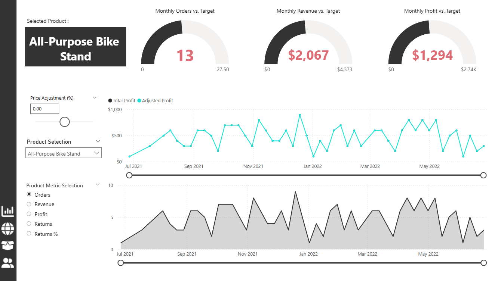
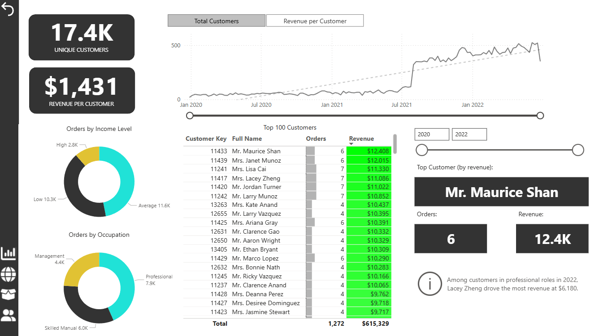

# Adventure Works Sales Dashboard
This Power BI dashboard provides a comprehensive view of sales, orders, returns, and customer behaviour for a bike and bike‑accessories business. It is designed to support fast, data‑driven decision‑making across operational, commercial, and customer‑facing teams.
The report is organised into four interactive tabs, each offering a different analytical perspective.

## Dashboard Pages
### 1. Executive Overview
A high‑level summary designed for leadership and quick performance monitoring.
This page includes key business KPIs such as:
- Total Revenue  
- Total Profit
- Total Orders
- Monthly Revenue
- Monthly Orders
- Monthly Returns
- Trending Revenue
- Top 10 Products
This tab provides an immediate snapshot of business health and highlights areas that may require deeper investigation. All visuals on this page change to display product related data when products are selected.

### 2. Map View
An interactive map showing where customer orders originate.
This page enables users to:
- Identify geographic hotspots
- Compare regional sales performance
- Understand customer distribution
- Spot emerging markets or underperforming areas

### 3. Product Detailed
A product‑focused view that allows users to explore:
- Orders by product
- Profit by product
- Adjusted Profit when product price is adjusted via Price Adjustment slicer
- Graphs which dates can be drilled down via slicer for more accurate observation
- Monthly Orders, Revenue and Profit vs Target gauges
Contextual filtering lets users click on a product, category, or time period to instantly update all visuals, making it easy to identify high‑margin items and underperforming stock.

### 4. Customers Detailed
A dedicated page for understanding product orders, returns and customer behaviour.
This tab includes:
- Total unique customers and revenue per customer
- Donut charts showing orders per income level and occupation
- Top 100 customers with number of orders and revenue generated 
- Interactive graph showing Total Customers and Revenue per Customer overtime
Contextual filtering allows users to isolate specific customers or time periods to understand where return issues are concentrated.

## Tools & Technologies
- Power BI Desktop
- Power Query for data cleaning and transformation
- DAX for calculated measures and KPIs
- Interactive visuals including maps, bar charts, line charts, and slicers

## How to Use This Dashboard
- Download the .pbix file from the repository.
- Open it in Power BI Desktop.
- Interact with slicers, filters, and visuals to explore the data.
- Use contextual filtering to drill into specific products, customers, or regions.
No additional setup is required unless you want to connect your own data source.

## Key Insights Enabled by This Dashboard
- Identify top‑performing products and categories
- Understand geographic sales distribution
- Monitor return rates and detect product quality issues
- Analyse customer behaviour and repeat purchase patterns
- Support inventory, marketing, and operational decisions
